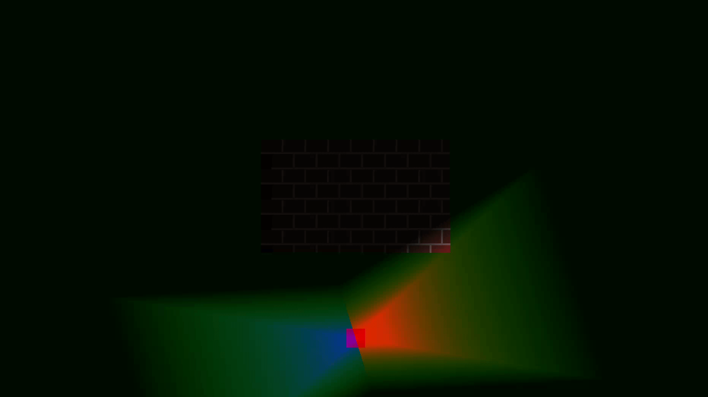

# SDL Dynamic Lighting Example


An test program that emulates dynamic lighting using SDL3


## Installation

download the latest release of SDL3 from https://github.com/libsdl-org/SDL

## Building

```bash
./build.sh
```

## running
```bash
./dist/lighting

# test with vsync
USE_VSYNC=1 ./dist/lighting

# test a single scene
SCENE=2 ./dist/lighting
```



<hr>


